このレクチャでは、RabbitMQをパソコンにインストール後、RabbitMQのマネジメントコンソールを使い、簡単な使い方をみていきます。

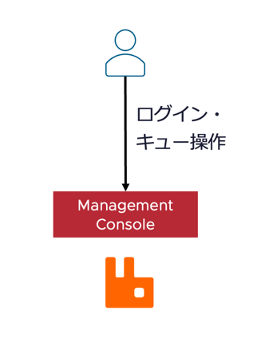

# RabbitMQ を端末にインストール

以下のコマンドによってRabbitMQをインストールします。  
※古いインタンスが存在する可能性を考え、再インストールによる方法を記載しています。

正式なインストール手順は、[ドキュメント](https://www.rabbitmq.com/docs/install-homebrew)を参照してください。

```
brew services stop rabbitmq

brew uninstall rabbitmq

# Now delete all node's data directories and configuration files.
# This assumes that Homebrew root is at /opt/homebrew
rm -rf /opt/homebrew/etc/rabbitmq/
rm -rf /opt/homebrew/opt/rabbitmq/
rm -rf /opt/homebrew/var/lib/rabbitmq/
# the launch agent file
rm -f $HOME/Library/LaunchAgents/homebrew.mxcl.rabbitmq.plist

# re-install
brew install rabbitmq
```

インストール後、以下のコマンドでフィーチャーを全て有効化します。

```
## start the service if necessary
brew services start rabbitmq

## after starting the service, enable all feature flags
/opt/homebrew/sbin/rabbitmqctl enable_feature_flag all
```

# RabbitMQ Managment Console にログイン

RabbitMQ のインストール後、以下のコマンドで管理GUIにログインしてください。

http://localhost:15672/

以下の画面が出力されることを確認してください。

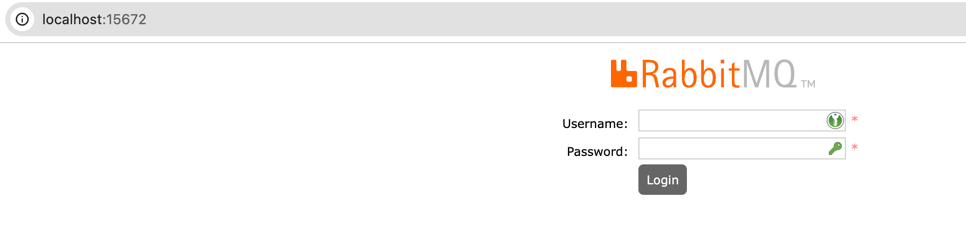

ユーザー名とパスワードは guest/guest です。
ログイン後、以下の画面になることを確認してください。

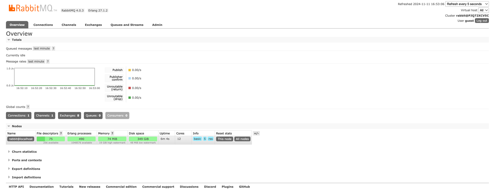

さらに Admin > Feature Flags を選択して、すべての Feature が Enabled になっていることを確認します。

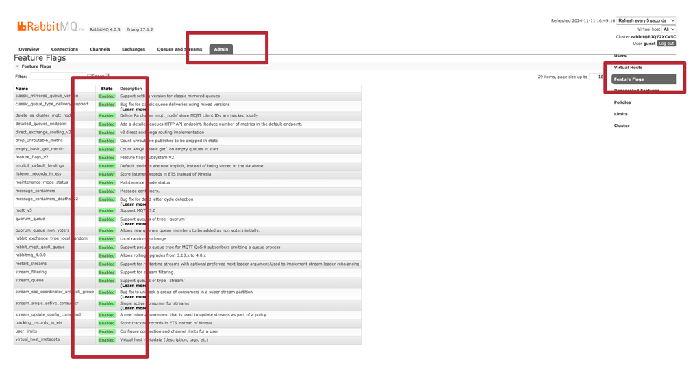

# Pub/Subの実施

簡単な Pub/Sub をRabbitMQのGUIでのみやってみます。

## Exchange の作成

Exchanges > Add a new exchange を選択後、Name に pubsub といれ、Add Exchange を押します。

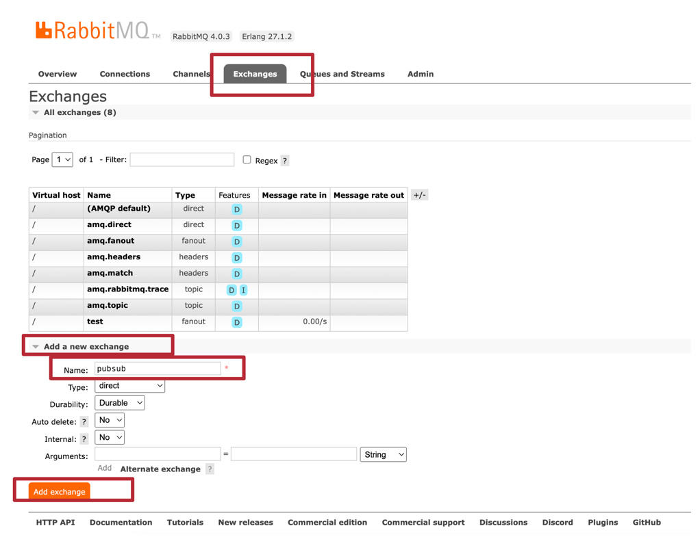

## Queue の作成

Queues and Streams > Add a new queue を選択後、Name に pubsub-queue といれ、Add Queue を押します。


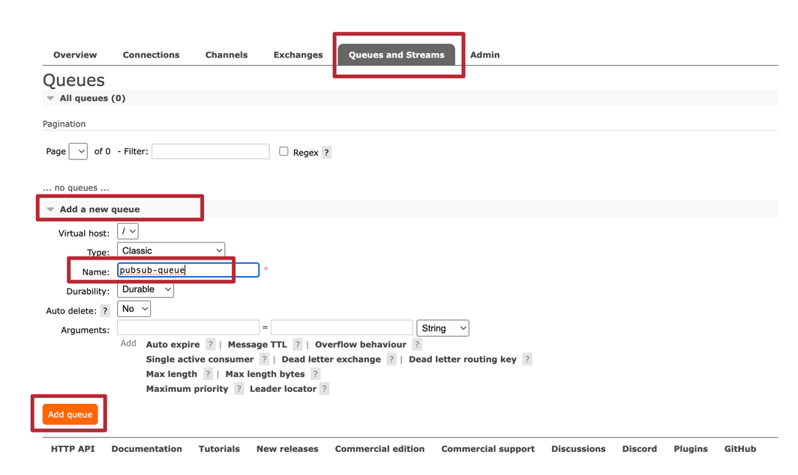

## Exchange と Queue を Bind

作成後、作成したQueueを選択します。

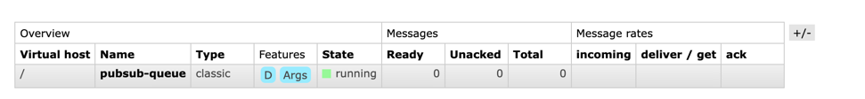

以下のような画面が出現します。

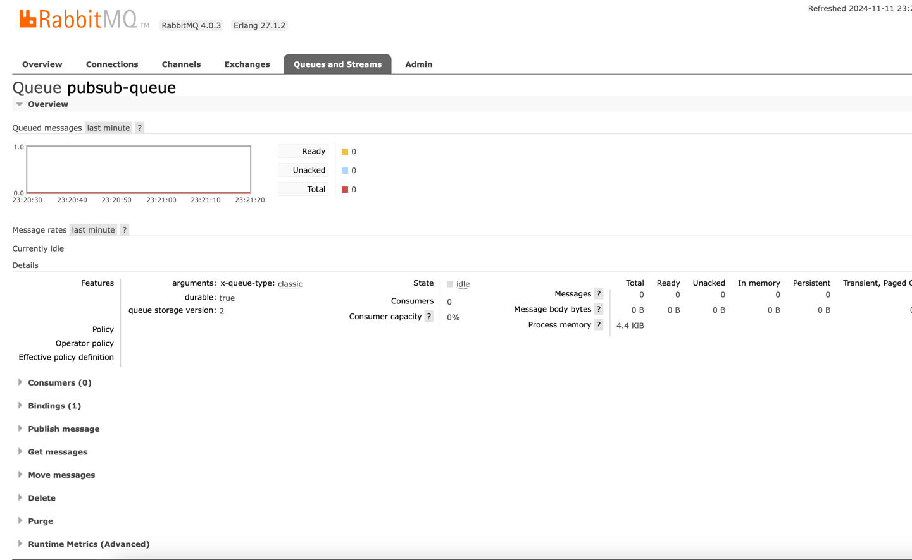

Bindings を選択して、From exchange: に pubsub を入力して、Bindをおします。

以下のようになります。

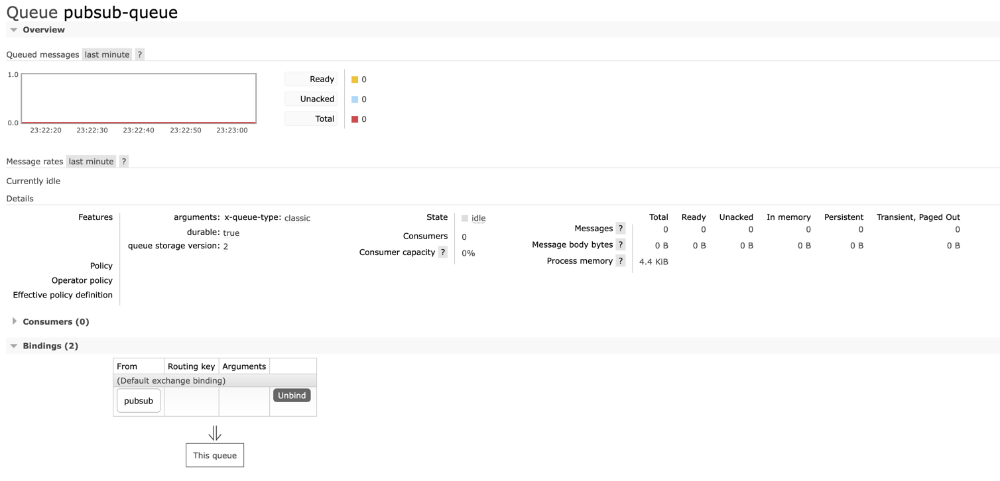

## Exchange からメッセージの送信

Exchangeを選択して、先ほどの Pubsub を選択します。

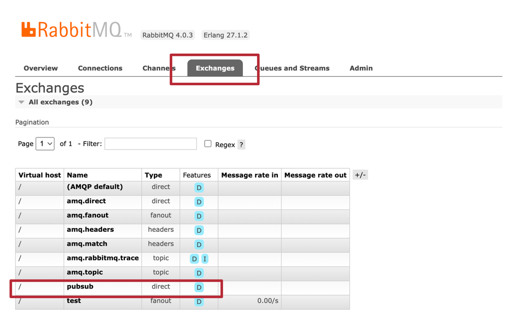

Publish message を展開して、Payload に適当な文字列を入れて、Publish message を選択します。
（Publish Message は好きな回数入力してください。）

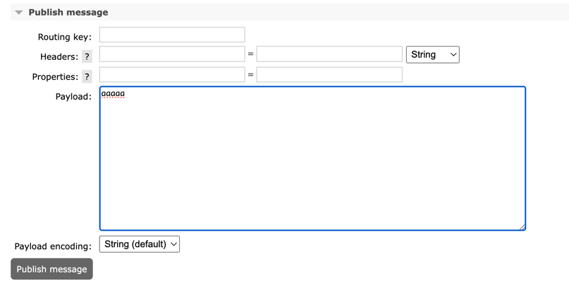

## Queue からメッセージを受信

Queues and Streams から pubsub-queue を選択します。

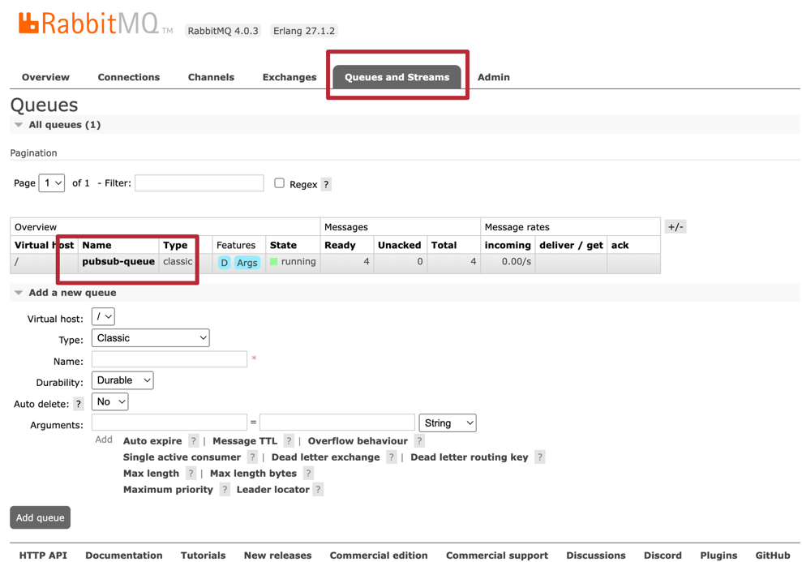

Get messages を展開して、Ack Mode  は Automatic ack を選択します。
その後、Get Message(s)を押します。結果Payloadをみると、前手順と同じものが出力されます。


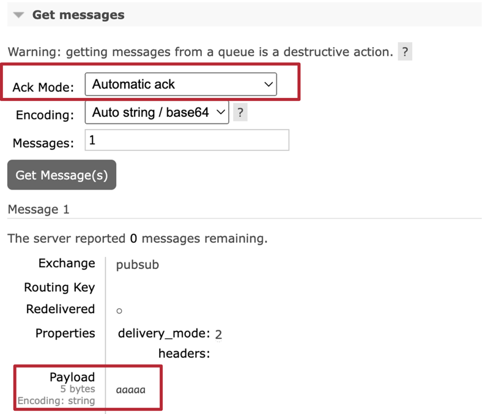