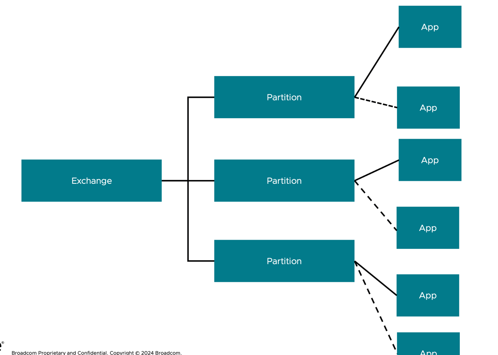

# RabbitMQ の本番化について

構成にかかわるトピック群

## Kubernetes Operator の利用

RabbitMQ を構成する上で、Kubernetesを使うことが推奨されます。
RabbitMQ の場合、以下の二つのオペレーターが非常に品質が高くメンテナンスされており、構成を含めすべてYAMLで表現ができるためです。

- [Cluster Operator](https://github.com/rabbitmq/cluster-operator)
- [Topology Operator](https://github.com/rabbitmq/messaging-topology-operator)

### Cluster Operator

レプリカなどの構成をYAMLで表現できます。例は以下をご参照ください。

https://github.com/rabbitmq/cluster-operator/tree/main/docs/examples

### Topology Operator

キューの作成などがYAMLで表現できます。例は以下をご参照ください。

https://github.com/rabbitmq/messaging-topology-operator/tree/main/docs/examples

## Shovel について

MACの場合、以下の方法でShovelを有効にします。
```
/opt/homebrew/sbin/rabbitmq-plugins enable rabbitmq_shovel rabbitmq_shovel_management
```

## Stream の本番化について

Stream を本番かする上でより高い分散度をはかる上で、Super Streams と、一意性を保証する Single Active Consumers が重要な構成ですのでご参考にしてください。



https://www.rabbitmq.com/blog/2022/07/13/rabbitmq-3-11-feature-preview-super-streams


