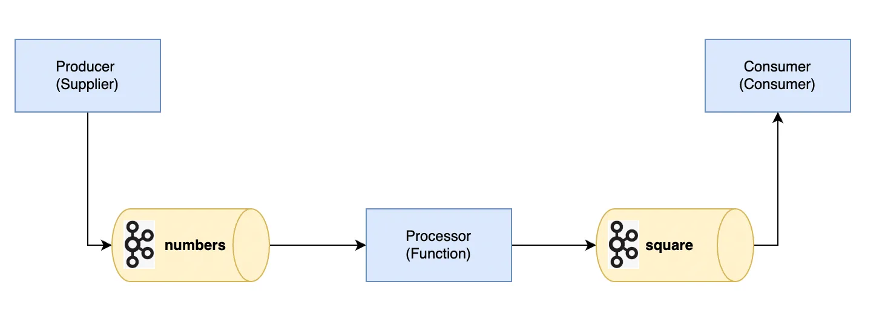
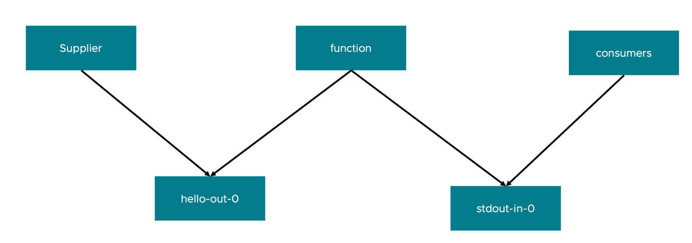

# Spring Cloud Streams の概要

Spring Cloud Streams とは、Java8から提供されたファクション型プログラミングをベースにデータの連携の流れがつくれる機能となっています。

Spring Cloud Streams では基本的に、以下のいずれかもしくは複数をプログラミングすることで、自動的にメッセージの管理に使えます。

- Supplier<T> : データを生み出す機構。Reactive(Flux, Mono) 型を使わない場合、自動的に1秒ごとに関数を実行する
- Function<T, R> : データの加工を行う機構。Tがインプットであり、Rがアウトプットになる関数を定義
- Consumer<T> : データを保存する機構

Spring Cloud Streams のメリットは、バックエンドのメッセージング基盤(e.g. RabbitMQ, Kafka) に関するプログラミングが簡素化されます。  
以下イメージ図です。（絵はKafka ですが・・・）



さらに [Spring Cloud Dataflow](https://spring.io/projects/spring-cloud-dataflow) と連携することが可能になり、開発物のアセット化、ローコード化にやくだてることができます。

ここでは、簡単な Spring Cloud Streams のアプリを紹介します。
前提として、RabbitMQがコンピューターにインストールされている前提です。

# 簡単な動作

- supplier : 1秒おき、`scs.demo.message` (デフォルト "Hello" )に定義されたメッセージをキューに発信します。
- function : メッセージに"Happy" を末尾につける
- consumers : stdout にアウトプットする

全てを起動すると、以下のメッセージが出て続けます。

```
2024-12-09T17:43:43.160+09:00  INFO 84285 --- [consumers] [           main] c.e.consumers.ConsumersApplication       : Started ConsumersApplication in 1.585 seconds (process running for 2.277)
HelloHappy
HelloHappy
HelloHappy
HelloHappy
HelloHappy
HelloHappy
HelloHappy
HelloHappy
...
```

SCS では自動的に、`<関数名>-<in or out>-<番号>` の Exchange や Bindings を自動的に作成します。
今回は [function](function/src/main/resources/application.properties) にだけ、それらが流れるようにマッピングを変更しています。

以下のイメージ図です。

